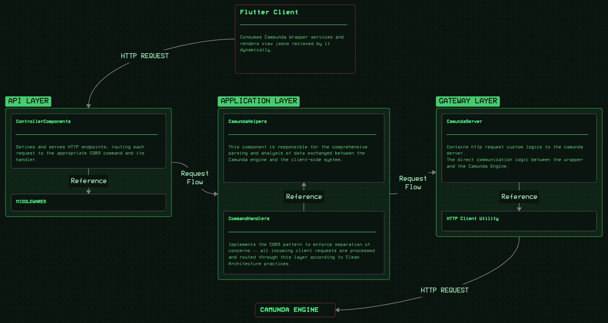

# Camunda BPMN Integration for Dynamic .NET Microservice Architecture

## Overview

This project showcases a **highly modular integration** of the **Camunda BPMN workflow engine** within a **.NET-based microservice ecosystem**, designed to provide **wrapped and fully dynamic BPMN services** to a **Flutter client application**.

The client — an enterprise in the **banking and legal domain** — needed a **scalable**, **maintainable**, and **future-proof** solution to manage a large number of evolving business processes without requiring frontend or backend code changes for every new BPMN update.

---

## Core Problem

Previously, every modification in BPMN definitions forced developers to update multiple layers of the system (backend services, frontends, and business logic).  
This process was inefficient, error-prone, and incompatible with rapid enterprise scaling.

The client wanted to:

- Integrate **Camunda BPMN** into their existing .NET environment.  
- Implement **customized but reusable** logic for each BPMN workflow.  
- Achieve **dynamic extensibility** — no redeployment needed for new or modified BPMNs.  
- Keep the **Flutter frontend** lightweight, stateless, and driven purely by API responses.

---

## Solution Architecture

I designed and implemented a **dedicated microservice** acting as a **Camunda wrapper service**, built with **clean layered architecture** and **high configurability**.

### Layered Structure

- **API Layer** — ASP.NET Core controllers exposing abstracted workflow operations.
- **Application Layer** — Command handlers and mediators (via **MediatR**) managing BPMN commands.
- **Core Layer** — Shared DTOs, models, and helper utilities for flexible data transformation.
- **Gateway Layer** — Low-level Camunda interaction layer for starting processes, completing tasks, and handling tokens dynamically.

Each layer is **loosely coupled** and **dependency-injected**, ensuring testability, modularity, and scalability.

---

## Dynamic BPMN Wrapping

Instead of static BPMN mappings, I implemented a **dynamic wrapping system** that:

- Automatically **reads BPMN variables and structures** at runtime.  
- Converts them into **generic dynamic types** for flexible processing.  
- Handles all data types and task payloads dynamically — no hardcoded BPMN logic required.  
- Makes the wrapper **future-proof** — new BPMNs can be deployed instantly without code changes.

This dynamic approach eliminated the need for workflow-specific coding, saving weeks of development effort per BPMN.

---

## Stateless Frontend Integration

A key innovation was the **View JSON System** — a dynamic intermediate layer between backend and frontend:

- Parses complex BPMN task data from Camunda.  
- Converts it into a **custom “View JSON”** — a structured JSON schema describing UI components.  
- Enables the Flutter client’s **dynamic render engine** to generate forms and user tasks **entirely at runtime**, with no hardcoded UI.

This architecture made the Flutter app **completely stateless** and **self-adapting** to any new BPMN process.

---

## Performance & Deployment

Despite the complexity and abstraction, the service achieves **response times below 800 ms** per BPMN request.  
It is currently **deployed in a production-grade enterprise environment**, powering multiple dynamic workflows with **no manual code intervention** for new processes.

All development, deployment, and architectural details remain under strict **NDA**, but the approach and core technical design are presented here for demonstration purposes.

---

## Key Achievements

- Designed and implemented a **modular microservice** architecture around Camunda BPMN.  
- Achieved **zero-code BPMN adaptability** through dynamic type processing.  
- Built a **custom View JSON layer** for stateless Flutter UI rendering.  
- Ensured **high performance** (<800 ms) despite deep data parsing and dynamic logic.  
- Delivered an **enterprise-ready**, **scalable**, and **future-proof** BPMN integration framework.  

---

---

## Summary

This project demonstrates how **workflow engines like Camunda** can be **cleanly and dynamically integrated** into modern .NET ecosystems while maintaining **architectural purity**, **stateless frontend logic**, and **enterprise-grade scalability** —  
a true demonstration of combining **software architecture, performance optimization, and domain abstraction** into a single system.

---

## ⚠️ Notes

This documentation represents only a **partial overview** of the implementation.  
Due to an **NDA agreement**, the full source code and proprietary configurations are **not included**.

---

