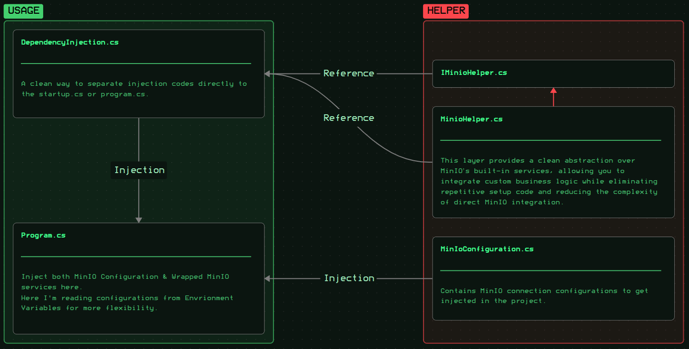

# MinIO Service Wrapping Example

This project demonstrates a modular and maintainable approach to integrating **MinIO** storage within a banking company’s **eKYC (Electronic Know Your Customer)** data management system.

---

## Overview

The client required a secure and efficient way to store and manage eKYC data using MinIO, while maintaining a **clean architecture**, **customizability**, and **controlled resource usage**.  
To achieve this, I developed a **wrapper service** around the official MinIO .NET SDK and published it as a **NuGet package** for internal use.

---

## Key Features

- **Abstraction Layer**  
  Encapsulates MinIO SDK operations behind custom service interfaces for better modularity and testability.

- **Dependency Injection Ready**  
  Fully integrated with .NET’s dependency injection system, allowing easy registration and lifecycle management of MinIO clients and services.

- **Configuration via Environment Variables**  
  Securely manages connection details (endpoints, credentials, buckets, etc.) using environment variables to support flexible deployment across environments.

- **Custom Helper Utilities**  
  Provides helper methods for optimized file handling, network efficiency, and error resilience.

- **Layered Architecture Integration**  
  Designed for seamless access across multiple layers (API, business logic, background services) without tight coupling to the underlying MinIO SDK.

---

## Implementation Structure

Below is a high-level schematic of the implementation components referenced in this documentation:

---

## ⚠️ Notes

This documentation represents only a **partial overview** of the implementation.  
Due to an **NDA agreement**, the full source code and proprietary configurations are **not included**.

---